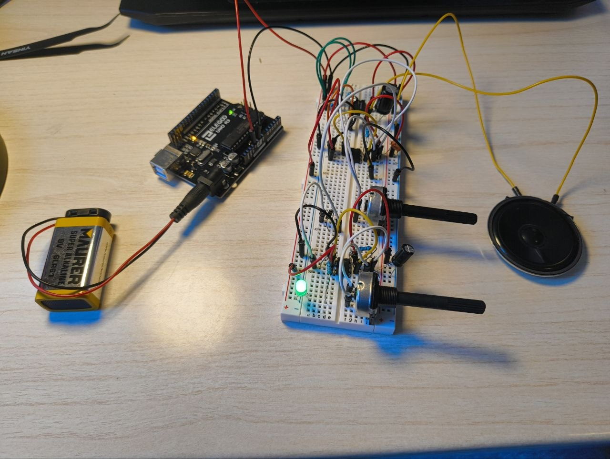

# Hybrid Synth Project

Educational analog/digital synthesizer developed during my Electronic Engineering studies.

The project was built progressively on a breadboard to explore oscillator design, modulation, analog audio amplification, filtering, signal acquisition and frequency-domain analysis.

Rather than focusing on musical performance, the objective was to use a simple synthesizer as a practical platform for studying how electronic signals are generated, modified, amplified and measured.

## Project Overview

The synthesizer is based on two NE555 timer circuits used for signal generation and modulation.

The generated signal is processed through passive components and amplified by an LM386 audio amplifier to drive an 8 Ω loudspeaker.

Two potentiometers provide analog control over the generated sound.

As a final experimental step, the oscillator output was acquired using an Arduino Uno ADC and analyzed in MATLAB in both the time and frequency domains.

### Signal chain

`NE555 oscillator → modulation / signal processing → LM386 → 8 Ω speaker`

For signal characterization:

`NE555 output → voltage divider → Arduino ADC → MATLAB`

## Objectives

The main objectives of the project were:

- understand astable oscillator operation;
- experiment with frequency control using passive components;
- explore modulation using multiple oscillators;
- build an analog audio amplification stage;
- observe the effect of filtering and component values on the output;
- acquire a real electronic signal using an ADC;
- apply sampling and Nyquist concepts experimentally;
- analyze a non-sinusoidal signal using the FFT;
- document the complete development process.

## Main Components

- 2 × NE555 timers
- LM386 audio amplifier
- Arduino Uno
- 8 Ω loudspeaker
- Passive buzzer
- Potentiometers
- Resistors and capacitors
- Diode
- Breadboard and jumper wires

## Development

### Phase 1 — Basic Oscillator

A NE555 timer was configured as an astable oscillator and connected to a passive buzzer.

This provided the first audible output and served as an introduction to timer-based signal generation.

### Phase 2 — Frequency Control

A potentiometer was introduced into the oscillator network, allowing the oscillation frequency to be modified manually.

This demonstrated the relationship between resistance, capacitance and the timing characteristics of the NE555.

### Phase 3 — Modulation

A second NE555 oscillator was added to experiment with interactions between two independently generated signals.

The resulting circuit produced more complex variations than the original single-oscillator configuration.

### Phase 4 — Audio Amplification

An LM386 audio amplifier was added to drive an 8 Ω loudspeaker.

The signal chain therefore evolved from a simple buzzer-based oscillator into an amplified audio circuit.

`NE555 → LM386 → Speaker`

### Phase 5 — Filtering and Sound Shaping

Passive RC networks and different capacitor values were tested to observe their influence on the generated signal and perceived sound.

This phase provided a practical application of basic frequency-selective networks.

### Phase 6 — Control Experiments

Additional control experiments were performed during development, including interaction with an Arduino.

The final synthesizer, however, does not depend on the Arduino for sound generation: the core audio system operates as an analog circuit.

### Final Phase — Signal Acquisition and Analysis

The final stage focused on experimentally characterizing the oscillator rather than adding further sound-generation features.

The output of the first NE555 was connected to Arduino A0 through a 10 kΩ / 10 kΩ voltage divider.

The Arduino was used as a data-acquisition interface, while MATLAB was used for signal processing and visualization.

## Experimental Analysis

500 ADC samples were acquired for each measurement.

The experimentally measured acquisition parameters were approximately:

| Parameter | Value |
|---|---:|
| Samples | 500 |
| Acquisition window | 56.1 ms |
| Average sampling period | 112.2 µs |
| Sampling frequency | 8.91 kHz |
| Nyquist frequency | 4.46 kHz |
| FFT bin spacing | 17.8 Hz |

To avoid serial communication limiting the sampling rate, the samples were first stored in the Arduino memory and transmitted only after acquisition.

Two different potentiometer configurations were measured.

### Experiment 1

The first configuration produced an estimated fundamental frequency of approximately:

**f₀ ≈ 731 Hz**

### Experiment 2

After changing the potentiometer setting, the measured fundamental frequency changed to approximately:

**f₀ ≈ 820 Hz**

The measurements experimentally demonstrate that changing the analog control modifies the oscillator frequency.

The FFT also reveals multiple harmonic components, consistent with the strongly non-sinusoidal waveform generated by the timer-based oscillator.

## MATLAB Analysis

MATLAB was used to:

- reconstruct the time axis from the measured sampling period;
- convert ADC samples into an approximate voltage;
- remove the DC component;
- compute the Fast Fourier Transform;
- visualize the time-domain waveform;
- visualize the frequency spectrum;
- estimate the dominant fundamental frequency.

The complete MATLAB acquisition and analysis code, figures and available raw measurement data can be found in the [`analysis`](analysis/) directory.

## Results

The final system successfully demonstrates a complete experimental chain:

`Analog generation → modulation → amplification → acoustic output → ADC acquisition → digital signal analysis`

The project connected several concepts studied independently in electronics and signal theory within a single physical prototype.

In particular, the final measurement stage provided practical experience with:

- oscillator behavior;
- analog signal conditioning;
- ADC acquisition;
- sampling frequency;
- Nyquist criterion;
- time-domain measurements;
- Fourier analysis;
- harmonic content.

## Limitations

This project was designed as an educational breadboard prototype rather than a precision synthesizer or measurement instrument.

The reconstructed voltage is approximate, and the FFT frequency resolution is limited by the 500-sample acquisition window.

The reported frequencies should therefore be interpreted as experimental estimates rather than precision measurements.

## Project Status

**Completed — September 2026**

The original development goals have been achieved.

Possible future extensions could include improved waveform generation, dedicated PCB design, higher-resolution acquisition or more advanced filtering, but these are intentionally outside the scope of the current project.
