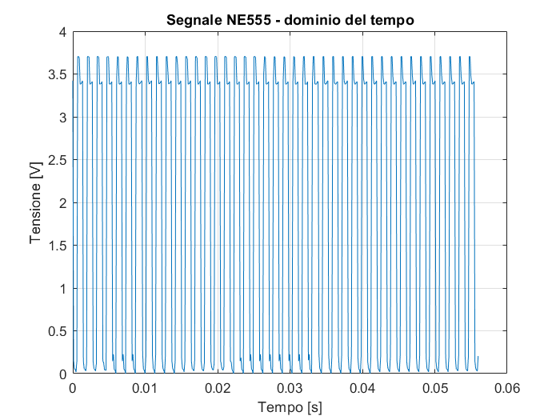
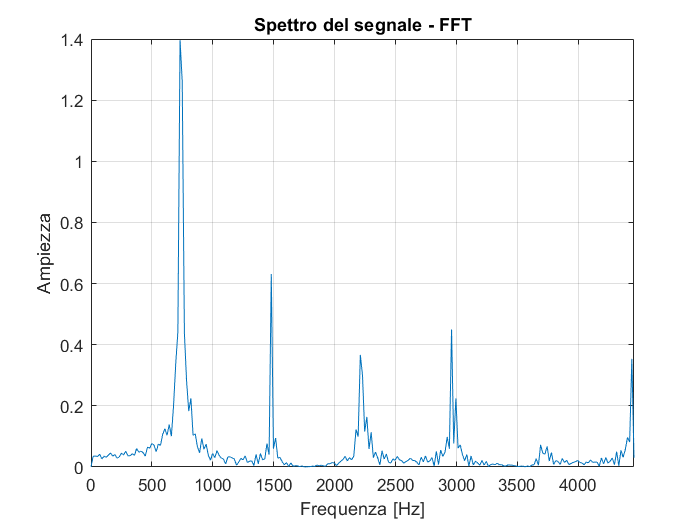

# Signal Acquisition and MATLAB Analysis

# Signal Acquisition and MATLAB Analysis

This section documents the experimental characterization of the signal generated by the hybrid synthesizer.

The objective was to move beyond functional verification of the circuit and directly observe its output in both the time and frequency domains.

## Measurement setup

The output of the first NE555 oscillator was acquired using the ADC of an Arduino Uno.

Because the oscillator output could not be connected directly to the analog input without appropriate voltage scaling, a 10 kΩ / 10 kΩ resistive divider was added between the NE555 output and Arduino A0.

The Arduino was used only as a data-acquisition interface. The synthesizer itself operates independently as an analog circuit.

### Acquisition chain

`NE555 output → 10 kΩ / 10 kΩ voltage divider → Arduino A0 → Serial → MATLAB`

The ADC samples were first stored in the Arduino memory and transmitted only after the acquisition was completed. This avoids serial communication becoming the limiting factor for the sampling rate.

## Acquisition parameters

The measured acquisition parameters were:

| Parameter | Value |
|---|---:|
| Number of samples | 500 |
| Acquisition time | ~56.1 ms |
| Average sampling period | ~112.2 µs |
| Sampling frequency | ~8.91 kHz |
| Nyquist frequency | ~4.46 kHz |

The sampling frequency was experimentally verified by measuring the execution time of repeated `analogRead()` operations.

## MATLAB processing

The acquired ADC samples were processed in MATLAB.

The analysis included:

- reconstruction of the time axis from the measured sampling period;
- conversion of ADC values into an approximate voltage;
- compensation for the 10 kΩ / 10 kΩ input divider;
- removal of the DC component before spectral analysis;
- Fast Fourier Transform (FFT);
- estimation of the dominant fundamental frequency;
- visualization of the waveform in the time and frequency domains.

The complete acquisition and processing code is available in [`synth_analysis.m`](synth_analysis.m).

---

## Experiment 1

The first control configuration produced a clearly periodic, non-sinusoidal waveform.

The estimated fundamental frequency was:

**f₀ ≈ 731 Hz**

### Time-domain waveform

### Frequency spectrum

The spectrum shows the fundamental component together with multiple harmonics, as expected from the non-sinusoidal oscillator waveform.

---

## Experiment 2

A second acquisition was performed after changing the potentiometer setting while keeping the acquisition system unchanged.

The estimated fundamental frequency was:

**f₀ ≈ 820 Hz**

### Time-domain waveform

### Frequency spectrum

The measured frequency therefore changed from approximately 731 Hz to 820 Hz, demonstrating experimentally the effect of the analog control on the oscillator.

---

## Results

| Measurement | Experiment 1 | Experiment 2 |
|---|---:|---:|
| Fundamental frequency | ~731 Hz | ~820 Hz |
| Sampling frequency | ~8.91 kHz | ~8.91 kHz |
| Nyquist frequency | ~4.46 kHz | ~4.46 kHz |
| Waveform | Non-sinusoidal | Non-sinusoidal |

The two measurements show that the control setting modifies the oscillation frequency while the generated signal retains a strong harmonic content.

## Notes and limitations

The voltage reconstruction is approximate because the ADC reference voltage was treated nominally during post-processing.

With 500 samples acquired at approximately 8.91 kHz, the observation window is approximately 56 ms and the FFT frequency-bin spacing is approximately 17.8 Hz. The reported fundamental frequencies should therefore be interpreted according to this measurement resolution rather than as high-precision frequency measurements.

The first experiment is preserved through its MATLAB figure files and exported plots. The raw CSV dataset retained in this repository corresponds to the second experiment.

## What this experiment demonstrates

This final characterization connects the physical oscillator circuit with concepts from signal processing and data acquisition:

- analog signal generation;
- ADC-based measurement;
- sampling frequency and Nyquist criterion;
- time-domain analysis;
- Fourier analysis;
- harmonic content of non-sinusoidal signals;
- experimental validation of frequency control.
